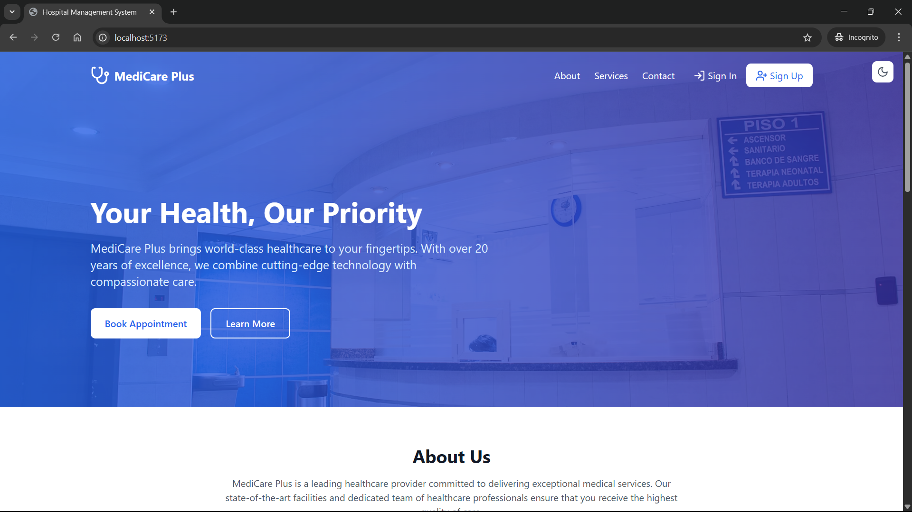
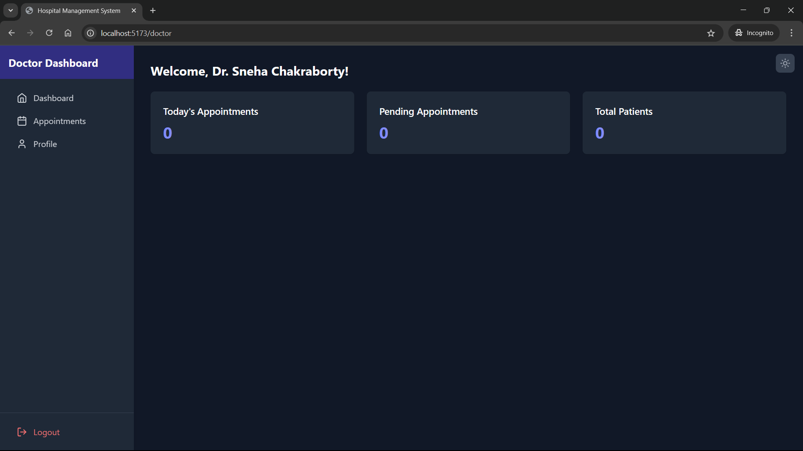
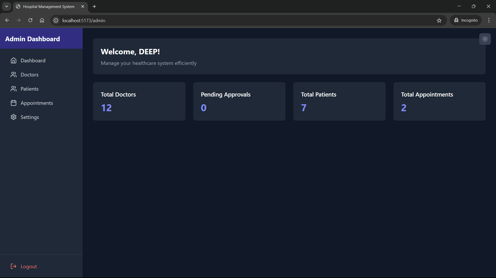

# 🏥 Hospital Management System (HMS) Pranayan Khan

## 🚀 Overview

The **Hospital Management System (HMS)** is a full-stack web application built using **Spring Boot** and **React (Vite)**, designed to efficiently manage healthcare operations. It offers role-based functionalities for **Admins**, **Doctors**, and **Patients** including appointment booking, user management, and secure authentication.

---

## 🎯 Features

- 🔐 **Authentication**: Role-based login and registration with secure password reset using security questions.
- 🧑‍⚕️ **Admin Dashboard**: 
  - Approve or reject doctor registrations.
  - Manage doctors, patients, and appointments.
- 👨‍⚕️ **Doctor Dashboard**:
  - View and manage appointments.
  - Access and update profile.
- 👤 **Patient Dashboard**:
  - Book and view appointments.
  - Update personal information.
- 🌗 **Responsive UI**: Built for both light and dark themes using TailwindCSS.
- 💾 **PostgreSQL Database**: Robust relational database integration with JPA.

---

## 🧱 Project Structure

### 🔧 Backend (Spring Boot)

- **Language**: Java 17+
- **Build Tool**: Maven
- **Database**: PostgreSQL with Spring Data JPA
- **Main Modules**:

  - `AdminService`
  - `DoctorService`
  - `PatientService`
  - `AppointmentService`

### 💻 Frontend (React + Vite)

- **Framework**: React JS
- **Routing**: React Router DOM
- **State Management**: Context API
- **Styling**: TailwindCSS
- **HTTP Client**: Axios

---

## 🛠️ Setup Instructions

### ✅ Prerequisites

- **Backend**: Java 17+, Maven, PostgreSQL
- **Frontend**: Node.js 16+, npm or yarn

---

## 📡 API Endpoints

<strong>Admin Endpoints</strong>

| Method | Endpoint | Description |
|--------|----------|-------------|
| POST | `/api/admins/register` | Register a new admin |
| POST | `/api/admins/login` | Login as an admin |
| GET | `/api/admins` | Get all admins |
| GET | `/api/admins/{username}` | Get admin details by username |
| GET | `/api/admins/check-username/{username}` | Check if admin username is available |
| POST | `/api/admins/reset-password` | Reset admin password using security question |
| GET | `/api/admins/profile` | Get logged-in admin profile |
| PUT | `/api/admins/profile` | Update admin profile |
| POST | `/api/admins/logout` | Logout admin |
| GET | `/api/admins/doctors` | Get all doctors |
| GET | `/api/admins/patients` | Get all patients |
| GET | `/api/admins/appointments` | Get all appointments |
| DELETE | `/api/admins/patients/{username}` | Delete patient by username |
| PUT | `/api/admins/doctors/{id}/status` | Approve/Reject doctor |

<strong>Doctor Endpoints</strong>

| Method | Endpoint | Description |
|--------|----------|-------------|
| POST | `/api/doctors/register` | Register a new doctor |
| POST | `/api/doctors/login` | Login as a doctor |
| GET | `/api/doctors` | Get all doctors |
| GET | `/api/doctors/{id}` | Get doctor details by ID |
| GET | `/api/doctors/check-username/{username}` | Check if doctor username is available |
| PUT | `/api/doctors/{username}` | Update doctor profile |
| POST | `/api/doctors/check-status` | Check doctor approval status |
| POST | `/api/doctors/reset-password` | Reset doctor password |
| POST | `/api/doctors/logout` | Logout doctor |

<strong>Patient Endpoints</strong>

| Method | Endpoint | Description |
|--------|----------|-------------|
| POST | `/api/patients/register` | Register a new patient |
| POST | `/api/patients/login` | Login as a patient |
| GET | `/api/patients/check-username/{username}` | Check if patient username is available |
| GET | `/api/patients/{id}` | Get patient details by ID |
| PUT | `/api/patients/profile/{username}` | Update patient profile |
| GET | `/api/patients/{username}/appointments` | Get patient's appointments |
| POST | `/api/patients/appointments` | Book new appointment |
| DELETE | `/api/patients/appointments/{id}` | Cancel appointment |
| POST | `/api/patients/reset-password` | Reset patient password |
| POST | `/api/patients/logout` | Logout patient |

<strong>Appointment Endpoints</strong>

| Method | Endpoint | Description |
|--------|----------|-------------|
| GET | `/api/appointments` | Get all appointments |
| GET | `/api/appointments/{id}` | Get appointment by ID |
| POST | `/api/appointments` | Create a new appointment |
| PUT | `/api/appointments/{id}` | Update appointment |
| DELETE | `/api/appointments/{id}` | Delete appointment |
| GET | `/api/appointments/available-slots` | Get available slots by date & doctor |

---

## 📷 Screenshots

### 🏠 Landing Page

### 👤 Patient Dashboard

### 👨‍⚕️ Doctor Dashboard

### 🧑‍💼 Admin Dashboard

---

---

